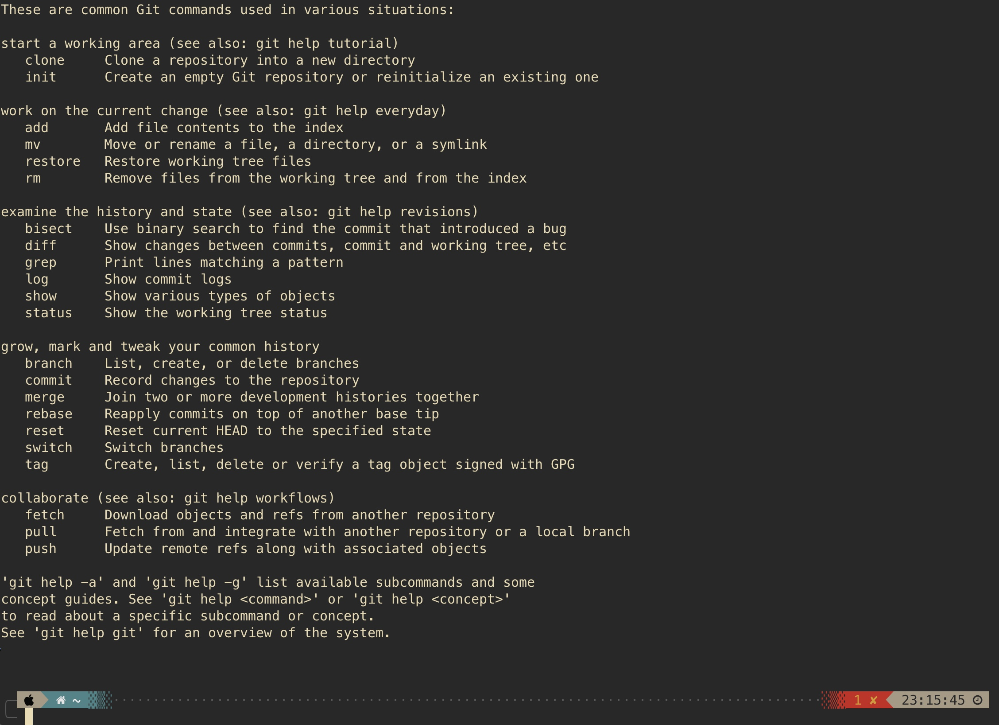
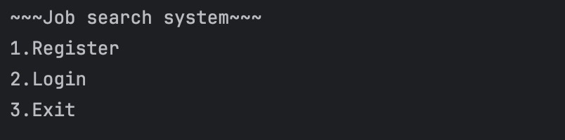
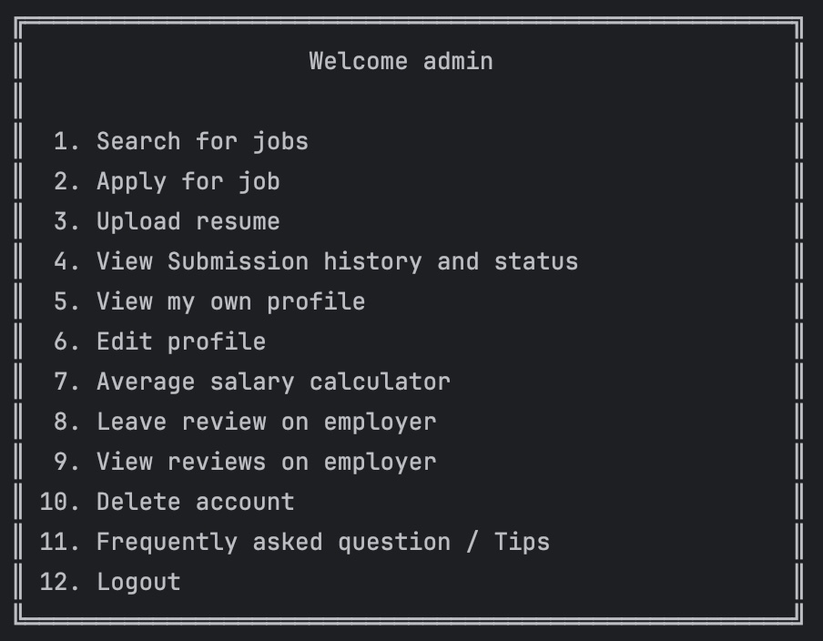
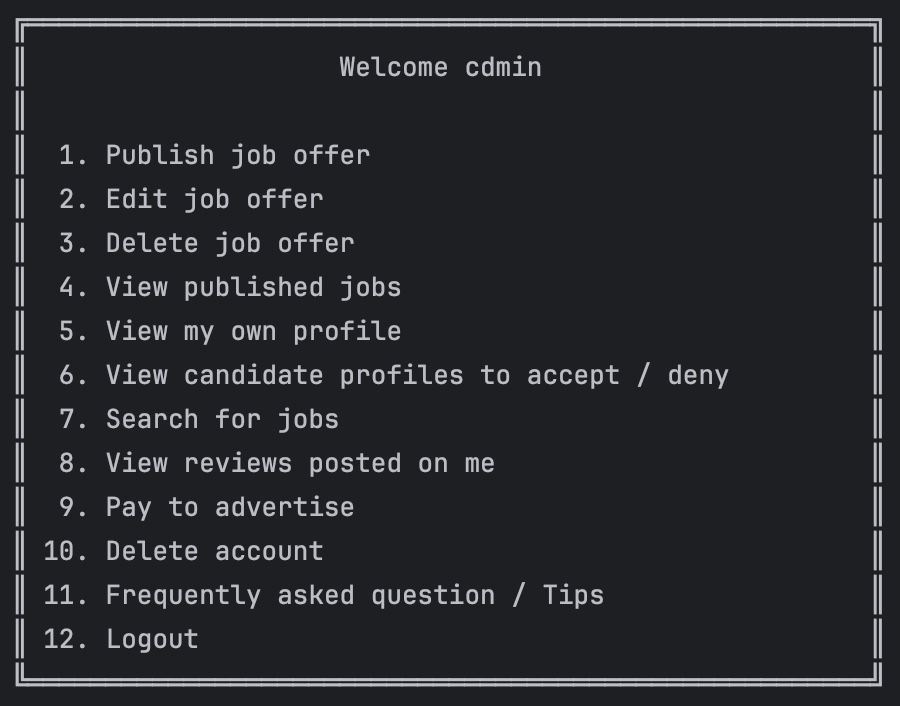

# Basics-of-Software-Engineering-Project

<h3 align="center">Basic git commands:<h3>

  
git init - create dir and open new "project" 
git add - מכין קבצים שארצה להכניס לבראנץ 
git commit -m "" - שומר את הקבצים שהכנתי בבראנץ 
git branch branch_name - מייצר ענף חדש בפרוייקט בשם שאבחר 
git branch - יציג את הענפים שקיימים כרגע בפרוייקט 
git checkout branch_name - יעביר אותנו לבראנץ | ענף אחר 

<h3 align="center">Progress indicator<h3>
<h2 align="left"> Main menu: </h2>
  
1.	Register ✅ 
2.	Login ✅ 
3.	Exit ✅ 

<h2 align="left"> Register menu: </h2>
Input id, password, first name, last name, age, location, phone number ✅ 

<h2 align="left"> Candidate menu: </h2>

1.	Search for jobs ✅ 
2.	Apply for job ✅ 
3.	Upload resume ✅ 
4.	View submission(s) history and status ✅ 
5.  View my own profile ✅ 
6.	Edit profile ✅(still needs resume checked further) 
7.	Average salary calculator ✅ 
8.	Leave review on employer ✅ 
9.  View reviews on employer ✅ 
10.	Delete account ✅ 
11.	Frequently asked questions / tips ✅ 
12.	Logout ✅ 

<h2 align="left"> Employer menu: </h2>

1.	publish job offer ✅ 
2.	edit job offer ✅ 
3.	delete job offer ✅ 
4.	View published jobs ✅ 
5.  View my own profile ✅ 
6.	View candidate profiles to accept / deny ✅(still needs to check properly resume) 
7.	Search for jobs ✅ 
8.  View reviews posted on me ✅ 
9.	Pay to advertise ✅ 
10.	Delete account ✅ 
11.	Frequently asked questions / tips ✅ 
12.	Logout ✅ 

<h2 align="left"> How to add resume files properly? </h2>
There is a folder named "Resumes", the code will immediately read from there the user should input the filename that is located there to read.
For example inside folder "Resumes" there is a file named "resume1" whenever asked for a filepath the user should input "resume1". 

<h2 align="left"> How is data stored inside files? </h2>
There is inside "Database" folder a file named "DataBase Explanation" that it's written there how each file information is seperated. 
There is 4 data files in total: 
1. Users data - stores all the info on a user, if user is employer also stores his / her reviews. 
2. Jobs data - stores all job listings / offers. 
3. Submissions data - Stores all submissions by candidate for job offers. 
4. Candidate Resumes - Stores information on resumes. 
